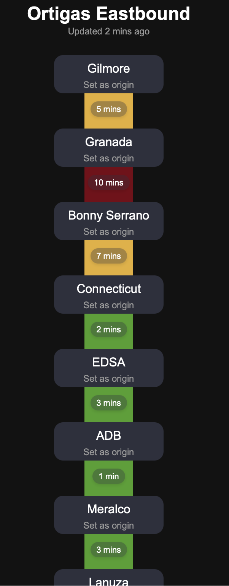
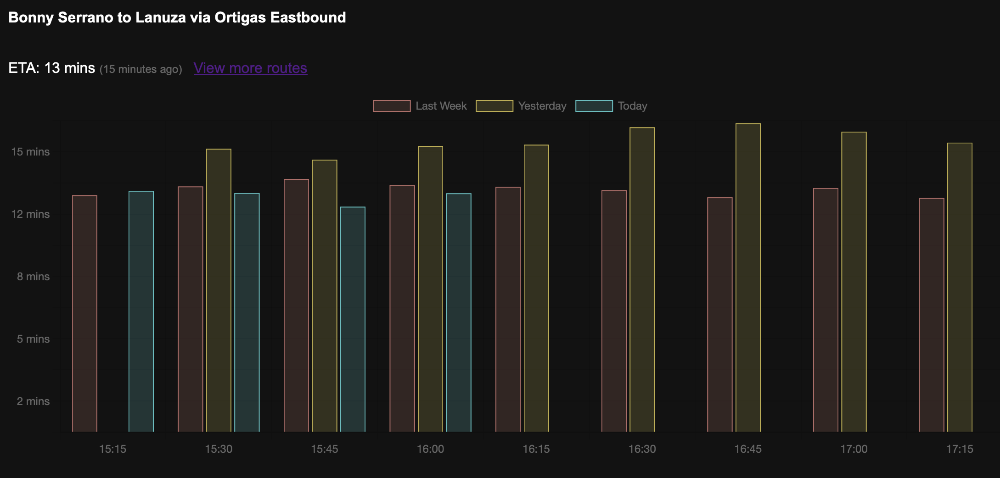

# What this is
- A tool to collect, store, and present traffic data in Metro Manila
- Inspired by [MMDA Traffic](https://mmdatraffic.interaksyon.com/system-view.php)
- An exercise in cloudflare, typescript, and sqlite
  - The frontend is mostly there to present the data, it's outside of my expertise
- View [demo](https://cign.enzosv.workers.dev)

# What this uses
1. Google Route API
2. Cloudflare Workers
3. Cloudflare D1

# Adding points on a route
- This is trivial, but may lead to more costs. I will consider adding more once I see the effects of the [pricing change](https://mapsplatform.google.com/resources/blog/build-more-for-free-and-access-more-discounts-online-with-google-maps-platform-updates/)