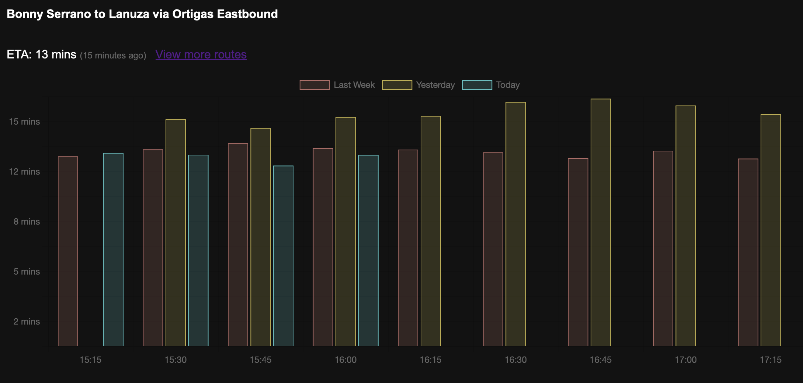

# What this is
- A tool to collect, store, and present traffic data in Metro Manila
- inspired by [MMDA Traffic](https://mmdatraffic.interaksyon.com/system-view.php)
- An exercise in typescript, and sqlite
  - The frontend is mostly there to present the data, it's outside of my expertise
- View [demo](https://cign.enzosv.workers.dev)

# What this uses
1. Google Route API
2. Cloudflare Workers
3. Cloudflare D1
